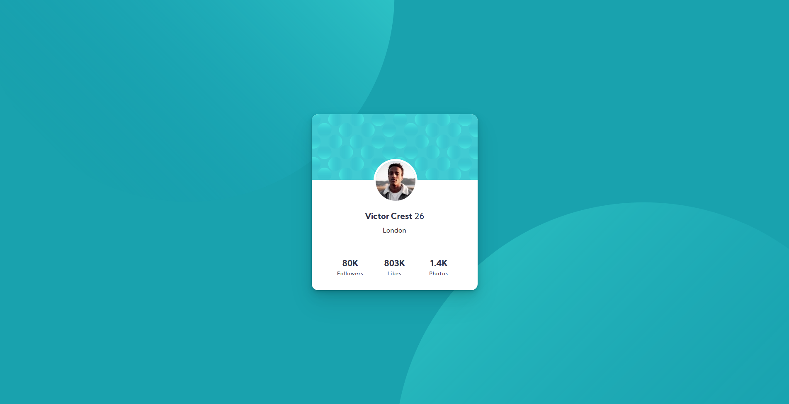
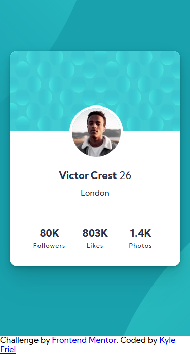

# Frontend Mentor - Profile card component solution

This is a solution to the [Profile card component challenge on Frontend Mentor](https://www.frontendmentor.io/challenges/profile-card-component-cfArpWshJ). Frontend Mentor challenges help you improve your coding skills by building realistic projects.

## Table of contents

-   [Overview](#overview)
    -   [The challenge](#the-challenge)
    -   [Screenshot](#screenshot)
    -   [Links](#links)
-   [My process](#my-process)
    -   [Built with](#built-with)
    -   [What I learned](#what-i-learned)
    -   [Continued development](#continued-development)
    -   [Useful resources](#useful-resources)
-   [Author](#author)

## Overview

-   Profile Card Component

### The challenge

-   Build out the project to the designs provided : Profile Card Component

### Screenshot

### Links

-   Solution URL: [Github Solution URL](https://github.com/kyle4real/Profile-Card-Component-Main)
-   Live Site URL: [Live Solution URL](https://kyle4real.github.io/Profile-Card-Component-Main/)

## My process

### Built with

-   Semantic HTML5 markup
-   CSS custom properties
-   Flexbox
-   CSS Grid
-   Mobile-first workflow

### What I learned

I learned that I am still confused when it comes to making images responsive, and making them do what I want...

### Continued development

I want to continue developing my skills with making images responsive, and making my projects more resonsive in general.

### Useful resources

-   [w3schools](https://www.w3schools.com/howto/howto_css_image_responsive.asp) - This helped me make images responsive
-   [tobiasahlin blog](https://tobiasahlin.com/blog/layered-smooth-box-shadows/) - This is a great resource for box-shadows

## Author

-   Website - [Kyle Friel - Github](https://github.com/kyle4real)
-   Frontend Mentor - [@kyle4real](https://www.frontendmentor.io/profile/kyle4real)
